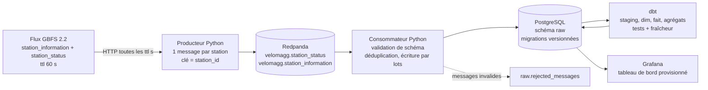
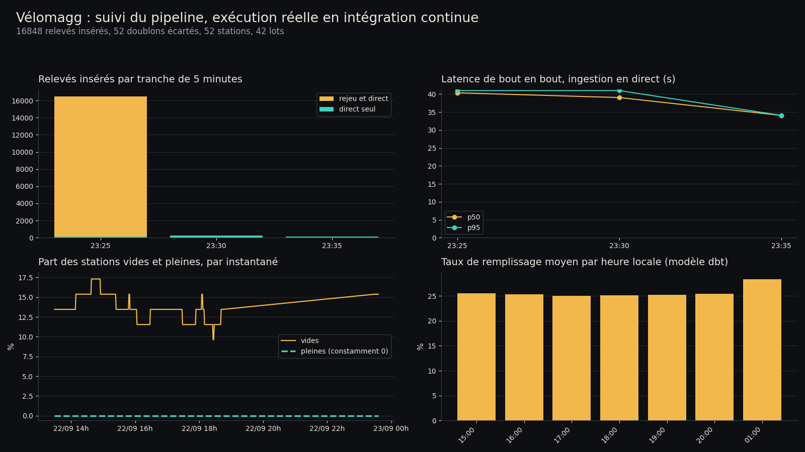

# Pipeline streaming des disponibilités Vélomagg (Montpellier)

Ingestion du flux GBFS temps réel des vélos en libre-service de Montpellier Méditerranée Métropole,
mise en file dans Redpanda, écriture dédupliquée dans PostgreSQL, modèle analytique dbt, tableau de bord
Grafana. Tout démarre avec `docker compose up -d`.

> **Où le pipeline a été exécuté.** Le poste de développement n'a pas de moteur Docker utilisable
> (Docker Desktop plante au démarrage sur un socket périmé : `removing stale socket: remove
> <HOME>\AppData\Local\Docker\run\userAnalyticsOtlpHttp.sock: The file cannot be accessed by the
> system`, trois tentatives, même erreur). La pile complète tourne donc dans l'intégration continue
> GitHub (`.github/workflows/ci.yml`, tâche `pipeline`) : `docker compose up -d`, rejeu de l'archive
> réelle de 5,14 heures commitée dans `archive/`, ingestion en direct pendant 8 minutes pour mesurer la
> latence, `dbt build`, `pytest`, export SQL des chiffres et artefact `resultats-pipeline`.

## Problème

Un exploitant de vélos en libre-service a besoin de savoir où les vélos manquent et où les bornes
saturent, heure par heure, pour organiser le rééquilibrage. Un usager a besoin de la même information à
l'instant présent. Le flux GBFS publie un instantané toutes les 60 secondes et n'en garde aucun
historique : dès qu'une valeur est remplacée, elle est perdue. Ce projet conserve ces instantanés, les
nettoie, les modélise et les expose, avec des garanties explicites sur les doublons et la latence.

## Architecture



Chaque flèche correspond à un service du `docker-compose.yml` : `producer`, `consumer`, `migrate`
(migrations SQL, exécuté une fois avant le consommateur), `dbt` (boucle `dbt build` toutes les
15 minutes), `postgres`, `redpanda`, `grafana`.

## Résultats réels

Tous les chiffres ci-dessous viennent d'une exécution complète de la pile, le 22/09/2026 :
**[run CI 35797505264](https://github.com/yzasmin/velomagg-streaming-pipeline/actions/runs/35797505264)**
(tâche `pipeline`, conclusion `success`). Ils sont produits par des requêtes SQL commitées
(`sql/resultats.sql`, exécutées par `scripts/export_results.py`) et versionnés dans `results/`.

Deux sources de messages dans ce run : le **rejeu** de l'archive réelle de 5,14 heures collectée le même
jour (13:28 à 18:37 UTC, `archive/*.jsonl.gz`, 16 432 messages de statut et 312 descriptions) et
l'**ingestion en direct** du flux pendant les 8 minutes du run, seule base valable pour la latence.

| Mesure | Valeur | Fichier |
| --- | --- | --- |
| Messages reçus par le consommateur | 17 264 | `results/synthese.json` |
| Messages de statut valides | 16 900 | `results/synthese.json` |
| Relevés insérés en base | 16 848 | `results/synthese.json` |
| Doublons écartés par la clé unique | 52 | `results/synthese.json` |
| Messages invalides (schéma) | 0 | `results/synthese.json` |
| Lots écrits par le consommateur | 42 | `results/synthese.json` |
| Stations décrites et observées | 52 | `results/synthese.json` |
| Latence de bout en bout en direct (p50 / p95 / max) | 38,44 s / 40,99 s / 40,99 s | `results/latence.json` |
| Latence du pipeline seul en direct (p50 / p95) | 2,879 s / 5,431 s | `results/latence.json` |
| Âge du flux au moment de la lecture (p50) | 34,54 s | `results/latence.json` |
| Relevés en direct servant à ces latences | 468 (9 instantanés) | `results/synthese.json` |
| Tests de qualité dbt | 35 réussis sur 35 (le total `PASS=42` de dbt ajoute les 7 modèles construits) | `results/dbt_build.txt` |
| Fraîcheur de la source | PASS | `results/dbt_source_freshness.txt` |
| Tests unitaires Python | 22 passés | `results/pytest.txt` |
| Relevés sans aucun vélo | 13,59 % | `results/vides_pleines_global.json` |
| Relevés sans aucune borne libre | 0,00 % | `results/vides_pleines_global.json` |
| Taux de remplissage moyen | 25,31 % | `results/vides_pleines_global.json` |
| Relevés avec plus de vélos que la capacité | 0 | `results/vides_pleines_global.json` |
| Mises à jour manquées pendant le direct | 0 (écart médian 60 s, max 61 s) | `results/instantanes_manques.json` |

Les 52 doublons écartés ne sont pas un hasard : l'archive contient une interrogation redondante, quand le
flux n'avait pas encore publié d'instantané neuf, soit exactement 52 relevés déjà connus, rejetés par
`ON CONFLICT (station_id, last_reported) DO NOTHING`. L'écart entre 17 264 messages reçus et 16 900
statuts valides correspond aux 364 messages de description de stations, comptés séparément.



Le débit de ce run ne mesure rien d'intéressant : c'est un rejeu, 16 432 messages injectés d'un coup. Ce
qui se mesure vraiment, c'est la latence de l'ingestion en direct, 38,4 s en médiane de bout en bout, dont
34,5 s d'âge du flux avant même la lecture et moins de 6 s pour tout le reste du pipeline au 95e centile,
et le fait que les 35 tests de qualité dbt passent sur 16 848 lignes. Le `PASS=42` affiché par `dbt build`
n'est pas un nombre de tests : il additionne 35 tests de qualité et 7 modèles construits (2 vues, 4 tables,
1 modèle incrémental), comme l'indique la ligne `Finished running` de `results/dbt_build.txt`.

Lecture métier, sur les 5,14 heures de fin d'après-midi rejouées : le réseau n'a jamais dépassé quelques
dizaines de vélos disponibles simultanément sur 659 bornes, 13,59 % des relevés correspondent à une
station sans aucun vélo, dont quatre stations vides sur la totalité de la période, et aucune station n'a
jamais été pleine. Le problème de ce réseau, sur cette tranche horaire, est la pénurie de vélos, pas la
saturation des bornes. Détail par station dans `results/stations_vides_pleines.csv`, détail horaire dans
`results/occupation_par_heure.csv`.


## Reproduire depuis un clone vierge

Prérequis : Docker Desktop (moteur démarré), et pour les tests [uv](https://docs.astral.sh/uv/).

```bash
git clone https://github.com/yzasmin/velomagg-streaming-pipeline.git
cd velomagg-streaming-pipeline
cp .env.example .env          # choisir des mots de passe
docker compose up -d          # redpanda, postgres, migrations, producteur, consommateur, dbt, grafana
docker compose ps             # tous les services doivent être "running" ou "healthy"
docker compose logs -f consumer   # "lot écrit : {'received': ..., 'inserted': ...}"
```

Le tableau de bord est sur <http://localhost:3000> (identifiant `admin`, mot de passe du `.env`, lecture
anonyme activée). PostgreSQL est publié sur `127.0.0.1:55432`.

```bash
# Tests unitaires et style
uv run pytest -q
uv run ruff check src tests scripts

# Modèles et tests de qualité des données (le service dbt les rejoue toutes les 15 min)
docker compose exec dbt dbt build

# Export des chiffres publiés, après quelques heures de collecte
uv run python scripts/export_results.py     # écrit results/*.json et results/*.csv
uv run --with matplotlib python scripts/figures.py

# Arrêt propre, sans supprimer les volumes
docker compose down
```

Rejouer l'archive réelle fournie (5,14 h, 16 432 relevés) plutôt que d'attendre le direct :

```bash
docker compose run --rm -v "$PWD/archive:/app/archive:ro" producer python -m velomagg.replay archive
```

Sans Docker du tout, pour au moins collecter le flux :

```bash
python scripts/archive_gbfs.py data/archive     # un instantané JSON par minute
python scripts/analyse_archive.py data/archive  # results/archive_*.json et .csv
```

Sans machine locale capable de faire tourner Docker, la pile s'exécute en intégration continue :
`gh workflow run ci.yml` puis `gh run watch`. La tâche `pipeline` monte le compose, rejoue l'archive,
ingère le flux en direct 8 minutes, lance `dbt build`, `pytest`, l'export SQL, et publie `results/`
en artefact.

## Structure

```
src/velomagg/       producteur, consommateur, migrations, rejeu d'archive, parsing GBFS
migrations/         V001__schema_brut.sql, V002__index_suivi.sql (schéma raw)
dbt/                projet dbt : staging, marts, tests génériques, boucle dbt build
grafana/            source de données et tableau de bord provisionnés (JSON généré par scripts/)
sql/resultats.sql   requêtes qui produisent les chiffres publiés
scripts/            archivage brut, analyse d'archive, export des résultats, figures, tableau de bord
archive/            archive réelle du flux (5,14 h, JSON Lines compressés) rejouable par velomagg.replay
tests/              tests pytest, avec des captures réelles du flux dans tests/fixtures/
results/            sorties versionnées (JSON, CSV, PNG)
```

## Données et licence

- Source : `https://gbfs.theta.fifteen.eu/gbfs/2.2/montpellier/en/gbfs.json`, flux GBFS 2.2 publié pour
  Montpellier Méditerranée Métropole, référencé sur
  [transport.data.gouv.fr](https://transport.data.gouv.fr/datasets/disponibilite-en-temps-reel-des-velos-en-libre-service-velomagg-de-montpellier).
- Système : `velomagg_montpellier`, opérateur TaM, `ttl` de 60 secondes, 52 stations.
- Licence annoncée dans `system_information.json` : **ODbL 1.0** (`license_url`
  `https://spdx.org/licenses/ODbL-1.0.html`) ; transport.data.gouv.fr mentionne l'ODbL assortie de
  conditions particulières d'utilisation. Le dépôt redistribue, sous cette même licence et avec cette
  attribution, l'archive de 5,14 heures de `archive/` (nécessaire pour rejouer le pipeline de façon
  reproductible), ainsi que les agrégats de `results/` et trois stations d'exemple dans `tests/fixtures/`.
- Le code de ce dépôt est publié sous licence MIT (voir `LICENSE`).

## Limites

1. **Aucune capture du tableau de bord Grafana.** La pile tourne dans un runner sans navigateur, et le
   poste n'a pas de moteur Docker : impossible d'afficher Grafana pour le photographier. Le service est
   provisionné et démarre bien (il figure dans `results/docker_compose_ps.txt`), son JSON est commité
   (`grafana/dashboards/velomagg.json`), et ses quatre panneaux sont reproduits en image à partir des
   mêmes requêtes SQL par `scripts/figures_pipeline.py`. Ce n'est pas une preuve que Grafana affiche bien
   ces panneaux, seulement que les données derrière existent.
2. **Le débit mesuré est celui d'un rejeu**, pas d'un flux en direct : 16 432 messages injectés d'un coup
   depuis l'archive. Seules les 8 minutes d'ingestion en direct, soit 468 relevés, mesurent une latence.
3. **Durée de collecte courte** : 5,14 heures d'un mardi après-midi. Aucun effet de pointe du matin, de
   week-end ni de météo n'est observable ; les agrégats horaires reposent sur sept heures locales.
4. **Latence bornée par la source** : le flux a 34,5 secondes d'âge en médiane au moment où il est lu,
   jusqu'à 60 secondes. Aucun pipeline ne peut faire mieux sur cette source, quelle que soit sa technologie.
5. **Livraison au moins une fois** : les décalages Kafka sont validés après le COMMIT PostgreSQL, donc un
   redémarrage relit le dernier lot ; l'unicité `(station_id, last_reported)` rend l'écriture idempotente,
   mais le compteur de messages reçus peut compter deux fois le même message.
6. **Pas de production** : un seul courtier sans réplication, PostgreSQL sans sauvegarde ni
   partitionnement (environ 75 000 lignes par jour), Grafana en lecture anonyme sur `localhost`, mots de
   passe dans un `.env` local, et des mots de passe jetables en clair dans le workflow CI, qui ne servent
   qu'à des conteneurs éphémères. Rien n'est prévu pour un déploiement exposé.
7. **Pas d'alerte** : les tests de fraîcheur dbt signalent une source figée au prochain `dbt build`, mais
   personne n'est prévenu.
8. **Un seul opérateur, une seule ville** : le modèle suppose la forme du flux Fifteen de Montpellier
   (`capacity` par station, instantané global). Un autre système GBFS demanderait de revérifier ces
   hypothèses, notamment les vélos libres hors station (`free_bike_status`), ignorés ici.

## Crédits

Réalisé par Yasmina Saoud, septembre 2026. Données Vélomagg de Montpellier Méditerranée Métropole (ODbL),
exploitées via le flux GBFS de Fifteen.
