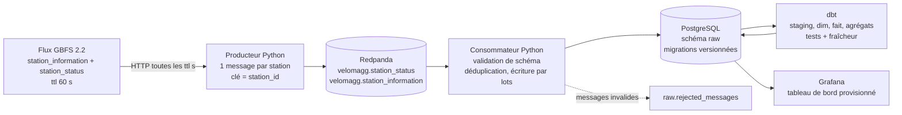
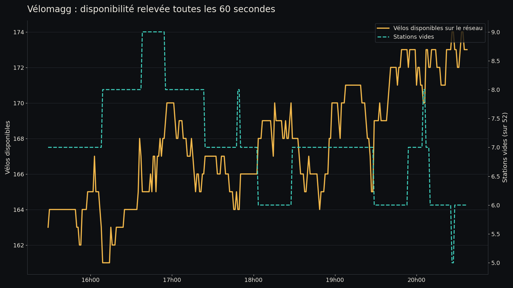

# Pipeline streaming des disponibilités Vélomagg (Montpellier)

Ingestion du flux GBFS temps réel des vélos en libre-service de Montpellier Méditerranée Métropole,
mise en file dans Redpanda, écriture dédupliquée dans PostgreSQL, modèle analytique dbt, tableau de bord
Grafana. Tout démarre avec `docker compose up -d`.

> **État d'exécution, à lire avant les chiffres.** Le pipeline complet n'a pas pu être exécuté sur le
> poste de développement : le moteur Docker Desktop plante au démarrage sur un socket périmé
> (`removing stale socket: remove <HOME>\AppData\Local\Docker\run\userAnalyticsOtlpHttp.sock: The file
> cannot be accessed by the system`, trois tentatives, même erreur). Les chiffres publiés plus bas
> proviennent donc de l'archive brute du flux, collectée en continu pendant la même période par
> `scripts/archive_gbfs.py`, et non d'une exécution des conteneurs. Les mesures qui n'existent qu'en
> exécution (latence p50 et p95, sorties de `dbt build`, capture Grafana) sont marquées « non mesurée ».
> `python -m velomagg.replay data/archive` rejoue l'archive dans le pipeline dès que Docker redémarre.

## Problème

Un exploitant de vélos en libre-service a besoin de savoir où les vélos manquent et où les bornes
saturent, heure par heure, pour organiser le rééquilibrage. Un usager a besoin de la même information à
l'instant présent. Le flux GBFS publie un instantané toutes les 60 secondes et n'en garde aucun
historique : dès qu'une valeur est remplacée, elle est perdue. Ce projet conserve ces instantanés, les
nettoie, les modélise et les expose, avec des garanties explicites sur les doublons et la latence.

## Architecture



Chaque flèche correspond à un service du `docker-compose.yml` : `producer`, `consumer`, `migrate`
(migrations SQL, exécuté une fois avant le consommateur), `dbt` (boucle `dbt build` toutes les
15 minutes), `postgres`, `redpanda`, `grafana`.

## Résultats réels

Collecte continue du flux le 22/09/2026, de 13:28:47 UTC à 18:37:15 UTC, soit **5,14 heures**.
Source des chiffres : `results/archive_synthese.json`, produit par `scripts/analyse_archive.py` à partir
de l'archive brute (`data/archive/*.jsonl`, non commitée car volumineuse et reproductible).

| Mesure | Valeur | Fichier |
| --- | --- | --- |
| Stations décrites et observées | 52 | `results/archive_synthese.json` |
| Capacité totale déclarée | 659 bornes | `results/archive_synthese.json` |
| Interrogations du flux | 309 | `results/archive_synthese.json` |
| Instantanés distincts | 308 | `results/archive_synthese.json` |
| Interrogations redondantes (doublons qu'écarte le pipeline) | 1 | `results/archive_synthese.json` |
| Relevés de station collectés | 16 016 | `results/archive_synthese.json` |
| Écart médian entre deux instantanés | 60 s (max 64 s, aucun au-dessus de 90 s) | `results/archive_synthese.json` |
| Âge du flux au moment de la lecture | médiane 35,9 s, maximum 60,0 s | `results/archive_synthese.json` |
| Relevés sans aucun vélo | 13,56 % | `results/archive_synthese.json` |
| Relevés sans aucune borne libre | 0,00 % | `results/archive_synthese.json` |
| Taux de remplissage moyen | 25,21 % | `results/archive_synthese.json` |
| Relevés avec plus de vélos que la capacité | 0 | `results/archive_synthese.json` |
| Tests unitaires Python | 22 passés | sortie de `uv run pytest -q` |
| Latence p50 et p95 de bout en bout | non mesurée (pipeline non exécuté) | |
| Résultats de `dbt build` | non mesurés (pipeline non exécuté) | |



Lecture métier : sur ces cinq heures de fin d'après-midi, le réseau n'a jamais dépassé quelques dizaines
de vélos disponibles simultanément sur 659 bornes, et 13,56 % des relevés correspondent à une station sans
aucun vélo, dont quatre stations vides sur la totalité de la période. Aucune station n'a jamais été pleine : le problème de ce réseau, sur cette tranche horaire,
est la pénurie de vélos, pas la saturation des bornes. Le détail par station est dans
`results/archive_stations.csv`, le détail horaire dans `results/archive_occupation_par_heure.csv`.

## Reproduire depuis un clone vierge

Prérequis : Docker Desktop (moteur démarré), et pour les tests [uv](https://docs.astral.sh/uv/).

```bash
git clone https://github.com/yzasmin/velomagg-streaming-pipeline.git
cd velomagg-streaming-pipeline
cp .env.example .env          # choisir des mots de passe
docker compose up -d          # redpanda, postgres, migrations, producteur, consommateur, dbt, grafana
docker compose ps             # tous les services doivent être "running" ou "healthy"
docker compose logs -f consumer   # "lot écrit : {'received': ..., 'inserted': ...}"
```

Le tableau de bord est sur <http://localhost:3000> (identifiant `admin`, mot de passe du `.env`, lecture
anonyme activée). PostgreSQL est publié sur `127.0.0.1:55432`.

```bash
# Tests unitaires et style
uv run pytest -q
uv run ruff check src tests scripts

# Modèles et tests de qualité des données (le service dbt les rejoue toutes les 15 min)
docker compose exec dbt dbt build

# Export des chiffres publiés, après quelques heures de collecte
uv run python scripts/export_results.py     # écrit results/*.json et results/*.csv
uv run --with matplotlib python scripts/figures.py

# Arrêt propre, sans supprimer les volumes
docker compose down
```

Repli sans Docker, pour commencer à collecter tout de suite :

```bash
python scripts/archive_gbfs.py data/archive     # un instantané JSON par minute
python scripts/analyse_archive.py data/archive  # results/archive_*.json et .csv
```

## Structure

```
src/velomagg/       producteur, consommateur, migrations, rejeu d'archive, parsing GBFS
migrations/         V001__schema_brut.sql, V002__index_suivi.sql (schéma raw)
dbt/                projet dbt : staging, marts, tests génériques, boucle dbt build
grafana/            source de données et tableau de bord provisionnés (JSON généré par scripts/)
sql/resultats.sql   requêtes qui produisent les chiffres publiés
scripts/            archivage brut, analyse d'archive, export des résultats, figures, tableau de bord
tests/              tests pytest, avec des captures réelles du flux dans tests/fixtures/
results/            sorties versionnées (JSON, CSV, PNG)
```

## Données et licence

- Source : `https://gbfs.theta.fifteen.eu/gbfs/2.2/montpellier/en/gbfs.json`, flux GBFS 2.2 publié pour
  Montpellier Méditerranée Métropole, référencé sur
  [transport.data.gouv.fr](https://transport.data.gouv.fr/datasets/disponibilite-en-temps-reel-des-velos-en-libre-service-velomagg-de-montpellier).
- Système : `velomagg_montpellier`, opérateur TaM, `ttl` de 60 secondes, 52 stations.
- Licence annoncée dans `system_information.json` : **ODbL 1.0** (`license_url`
  `https://spdx.org/licenses/ODbL-1.0.html`) ; transport.data.gouv.fr mentionne l'ODbL assortie de
  conditions particulières d'utilisation. Les données brutes ne sont pas redistribuées dans ce dépôt :
  seuls les agrégats de `results/` et trois stations d'exemple dans `tests/fixtures/` y figurent.
- Le code de ce dépôt est publié sous licence MIT (voir `LICENSE`).

## Limites

1. **Le pipeline n'a pas été exécuté** : moteur Docker en panne sur le poste (voir l'encadré en tête).
   Latence, résultats `dbt build` et capture Grafana restent à mesurer ; le code correspondant est écrit,
   testé unitairement et analysé par `dbt parse`, ce qui ne remplace pas une exécution.
2. **Durée de collecte courte** : 5 heures d'un mardi après-midi. Aucun effet de pointe du matin, de
   week-end ni de météo n'est observable ; les agrégats horaires reposent sur six heures locales.
3. **Latence bornée par la source** : le flux a en médiane 36 secondes au moment où il est lu, jusqu'à
   60 secondes. Aucun pipeline ne peut faire mieux sur cette source, quelle que soit sa technologie.
4. **Livraison au moins une fois** : les décalages Kafka sont validés après le COMMIT PostgreSQL, donc un
   redémarrage relit le dernier lot ; l'unicité `(station_id, last_reported)` rend l'écriture idempotente,
   mais le compteur de messages reçus peut compter deux fois le même message.
5. **Machine locale, pas de production** : un seul courtier sans réplication, PostgreSQL sans sauvegarde
   ni partitionnement (environ 75 000 lignes par jour), Grafana en lecture anonyme sur `localhost`,
   mots de passe dans un `.env` local. Rien n'est prévu pour un déploiement exposé.
6. **Pas d'alerte** : les tests de fraîcheur dbt signalent une source figée au prochain `dbt build`, mais
   personne n'est prévenu.
7. **Un seul opérateur, une seule ville** : le modèle suppose la forme du flux Fifteen de Montpellier
   (`capacity` par station, instantané global). Un autre système GBFS demanderait de revérifier ces
   hypothèses, notamment les vélos libres hors station (`free_bike_status`), ignorés ici.

## Crédits

Réalisé par Yasmina Saoud, septembre 2026. Données Vélomagg de Montpellier Méditerranée Métropole (ODbL),
exploitées via le flux GBFS de Fifteen.
